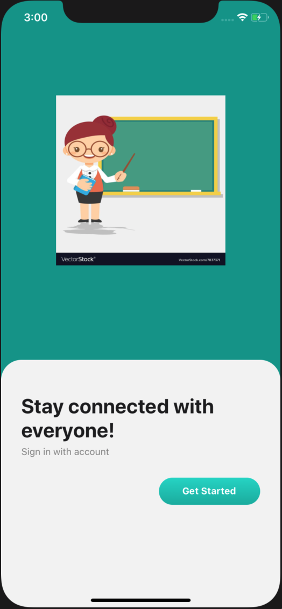

# React-native-Boilerplate

git clone https://github.com/sushreeta/React-native-Boilerplate.git

npm install

npx pod-install ios

npm run ios / npm run android

# Features:
  * Navigation Drawer
  * Redux-saga
  * Theming
 
# Screenshots:

